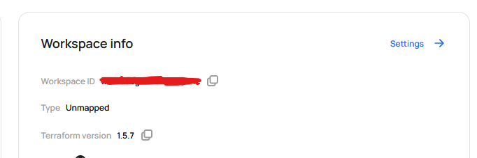

# Scalr

## Todo 
- [ ] Look at notifications
- [ ] Configure drift detection schedule


## Points of interest

scalr cannot accept terraform code/state files that are above 1.5.9. **This means we will have to understand the migration process for these particular projects.**

Both VCS and cli driven workflows are supported by scalr.

Getting very strange issue when destroying an environment after uploading the state.

### Structure
I think we need to create a module for the standard vsphere stuff, that's they typical and the workspace will need to be assigned providers

## Migration

Download the latest version of scalr from [here](https://github.com/scalr-platform/scalr-ui/releases) and extract it to a folder.

The command to get information on state upload is `scalr -help create-state-version`

``` shell
Usage: scalr [OPTION] create-state-version [FLAGS] [< json-blob.txt]

  Create a state version and set it as the current state version for the given workspace.

Flags:
  -force=BOOLEAN
  -lineage=STRING       Lineage of the state version. Should match the lineage extracted from the `terraform.tfstate`.
  -md5=STRING           The MD5 hash of the terraform.tfstate.
  -run-id=STRING        The the optional run associated with the state version.
  -serial=INTEGER       The serial of the state version which must match the `serial` value from the `terraform.tfstate`.
  -state=STRING         Base64 encoded `terraform.tfstate`
  -workspace-id=STRING  The workspace, this state version belongs to.
```

You will also need to download the state file using `terraform state pull > terraform.tfstate`.

To get the lineage and serial of the current state use:
`cat terraform.tfstate | jq -r '.lineage'`
`cat terraform.tfstate | jq -r '.serial'`

The file also needs to be base64 encoded using `base64 -w 0 -i terraform.tfstate`.

The md5 hash is also required to ensure that the state version has not been tampered with. This can be obtained using `md5sum terraform.tfstate`.

To just get the md5sum use the following
`md5sum terraform.tfstate | awk '{print $1;}'`

The last part required is the Workspace ID, this comes from the scalr side and determines the destination of the state version. To obtain this we will need to have the environment and workspace structure in place beforehand. The workspace ID can be found in the web UI on the workspace page under workspace info.



This can all then be combined into a single command like so:

``` shell
scalr -verbose create-state-version \
-state=$(base64 -w 0 -i terraform.tfstate) \
-md5=$(md5sum terraform.tfstate | awk '{print $1;}') \
-lineage=$(cat terraform.tfstate | jq -r '.lineage') \
-serial=$(cat terraform.tfstate | jq -r '.serial') \
-workspace-id=<workspace_id>
```
