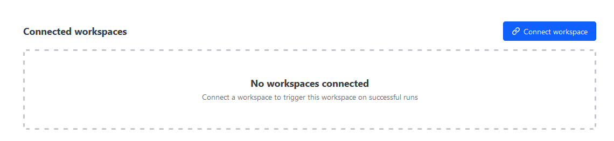

# Terraform cloud

## Notes

- Providers are done via variables/variable groups that can be set up as environment variables
- Terraform version is set not in code but in the GUI?
- [ ] What is the agent installation method? - do they have Helm install?
- [ ] Confirm that drift detection is not in the free service
- [ ] Confirm if module updates in downstream can kick off a plan on consumers

Connected workspaces is very interesting

## Migration steps
Offical [docs](https://developer.hashicorp.com/terraform/tutorials/cloud/cloud-migrate) show to migrate via cli/init